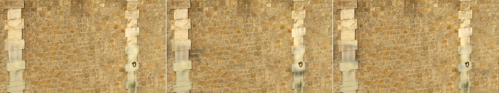

# ShadowRemoval 阴影消除

- This repository contains some shadow removal methods that I realized when I was working in a lab as an undergraduate student, including image shadow removal and video shadow removal
- 这个仓库存放的是我本科在实验室时实现的一些阴影消除方法，包括图像阴影消除和视频阴影消除

- As a common optical phenomenon in nature, shadows are easily recorded in images and videos. The low brightness of the shadow area may interfere with the further analysis and processing of images and videos, and affect the accuracy of the analysis results. Video shadow removal aims to accurately detect the shadow area contained in the video, and eliminate it in a targeted manner, restore it to the area under normal lighting conditions, and maintain the continuity between video frames. Video shadow removal is of great significance in the research of computer vision and graphics.
The shadow removal of video covers many problems that need to be solved urgently. First of all, the video may be shot by a static camera or a dynamic camera. This causes the scene itself to contain complex motions such as translation and rotation, which brings a huge test to the temporal and spatial consistency of the video after shadow removal. Secondly, the composition of shadows may be multiple areas, and there may be multiple shadows of different compositions in the same frame of image. According to the traditional processing method, this needs to distinguish the scene, and detect the shadow areas separately, and restore them with different lighting restoration parameters. Finally, because of the large lighting changes at the shadow boundary, there are serious loss of details and errors in lighting restoration in the boundary processing. Therefore, how to deal with the shadow boundary is also a problem to be solved.
- 阴影作为自然界中常见的光学现象，十分容易被记录到图像、视频当中。而阴影区域亮度低的特点可能对图像和视频的进一步分析处理带来干扰，影响分析结果的准确性。阴影消除旨在准确检测图像或视频中所包含的阴影区域，并且针对性地进行消除，将其恢复成正常光照条件下的区域，对于视频，还应保持视频帧间的连续性。视频阴影消除在计算机视觉和图形学的研究中有重要意义。视频的阴影消除涵盖了许多亟待解决的问题。首先，视频的拍摄可能是由静态摄像机所拍摄或动态摄像机所拍摄，这导致了场景本身可能包含平移和旋转等复杂运动，给阴影消除后视频的时空一致性带来了巨大考验。其次，阴影的组成可能是多区域的，同一帧图像内可能有多个不同构成的阴影，按照传统处理方法，这需要区分场景，并分别检测出阴影区域，并用不同的光照还原参数分别进行还原。最后，因为阴影边界处拥有较大的光照变化，在边界处理上有严重丢失细节、光照还原出错等问题。因而如何处理阴影边界也是一个需要解决的问题。

## Image Shadow Removal 图像阴影消除

- This project mainly implements a pyramid-based light recovery model to remove shadows in an image. 这个工程主要实现了基于金字塔的光照恢复模型，并用该模型进行图像阴影消除。

- Main formulas 主要公式
    - $I(x, λ) = L(x, λ)·R(x, λ)$
    - $I^shadow (x, λ) = a(x)·L^a (x, λ)·R(x, λ)$
    - $I^lit (x, λ) = L^d ·(x, λ)·R(x, λ) + \frac {1}{a(x)} · I^shadow $

- Test Case 测试用例 (python2)
    - Input
        
        
    - Shadow Detection
        
        
    - Result
        
        

## Video Shadow Removal 视频阴影消除

- Compared with other methods, the contributions of this method are:
    1. A new image shadow elimination model is proposed, which can effectively restore the lighting information and texture details of the shadow area, and solve the problem of shadow boundary that may occur after shadow elimination and the brightness inconsistency between the shadow area and the non-shadow area.
    2. A video shadow elimination algorithm based on shadow key frames is proposed. The algorithm can process the video taken by the dynamic camera, and solve the problem of discontinuity and jitter between frames that may occur after the video shadow is eliminated, and obtain a more realistic and natural shadow-free result. Most critically, this paper greatly reduces the required computing resources, and only requires less computing resources and time to obtain results similar to the previous extremely long time-consuming methods.
- 与其他方法相比，本文方法的贡献有： 
    1. 提出了一个新的图像阴影消除模型，该模型能有效恢复阴影区域的光照信息及纹理细节，并解决阴影消除后可能出现的阴影边界问题及阴影区域与非阴影区域之间的亮度不一致问题。
    2. 提出了一个基于阴影关键帧的视频阴影消除算法。该算法可以处理动态摄像机拍摄的视频，并且解决了视频阴影消除后可能出现的帧间不连续及抖动问题，获得较为真实自然的无阴影结果。最为关键的，本文极大削减了所需计算资源，仅需较少的计算资源和时间即可获得和以往极长耗时方法得到近似的结果。

- Main steps 主要步骤
    - Overview
        
    
    - Extract shadow keyframe 阴影关键帧提取
        

        
    
    - Image morphology processing 图像形态学处理
    
    - Remove shadows in keyframe 对关键帧进行阴影消除 (This part of codes must be run with CUDA, Caffe and TF under Ubuntu16)
        - Use G-Net to extract global features 使用G-Net提取全局特征
        - Use A-Net to extract shallow features 使用A-Net提取浅层特征
        - Use S-Net and G-Net to extract semantic features 使用S-Net和G-Net提取语义信息
        - Train the networks separately in multiple stages 多阶段分网络组合训练 (G-Net + A-Net / G-Net + S-Net)
        - Use Mean Squared Error in log space as loss function 使用 MSE 在 log 空间作为损失函数
        
        
        
        
    
    - Extract features with VGG Net and use features to fix image 使用 VGGNet 提取特征并用以修复图像
        - [VGG](https://arxiv.org/abs/1409.1556) From `Karen Simonyan, Andrew Zisserman`, codes not included in the project.

        
        
        
        
    
    - Use inter-frame correlation to eliminate non-key frame shadows 使用帧间关联性消除非关键帧阴影
        
        
    
    - Further shadow detection and optimization of non-key frames 对非关键帧进一步优化
        - 边界修复
            

- Main formulas 主要公式
    - $I_x=R_x· (αL_x^d+ L_x^a ),α∈[0,1]$
    - $T_i=  (q+1)/(a_x q+1)  I_i$
    - $q=  (I_i- I_i^recover)/(α_i I_i^recover- I_i )$
    - $I_i^recover=  σ(L)/σ(S)  (I_i- μ(S))+ μ(L)$
    - $∑(T_i^free- T_i)^2+ λ_3 ∑w_i (T_i^free- T_i^before)^2$

- Results (a series of continuous frames) 结果（一段连续帧）
    - Still handheld camera 静止手持摄像
        
        
        
    - Lateral motion camera 横向运动摄像
        
    - Longitudinal motion camera 纵向运动摄像
        
    - In-situ motion camera 原地运动摄像
        
        

- Full document 完整文档:
    - [Video Shadow Removal based on Keyframe 基于关键帧的视频阴影消除](Video_C++/基于关键帧的视频阴影消除.pdf)